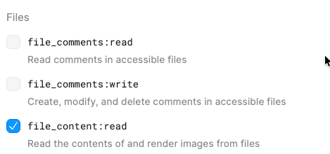

# Data Extract – Figma Text Extraction (figmaExtractV1)

This script extracts visible text content from Figma designs and generates flat TypeScript files for use in E2E tests and UI validation

## Script location

pcs-api/src/e2eTest/scripts/figmaExtractV1.ts

## What this script does

- Extracts visible text from Figma pages or frames
- Detects page titles (H1)
- Merges multiple states of the same page
- Outputs flat `.ts` files for use in automated tests

## Prerequisites

- Node.js v18+
- npm
- Access to the Figma file

## Install dependencies

Run from the project root:

npm install axios
npm install -D ts-node typescript @types/node

## Required environment variables

### 1. FIGMA_API_TOKEN

A Figma Personal Access Token.

How to generate:
1. Open Figma
2. Go to Help and Account -> Account Settings -> Security tab
3. Navigate to **Personal access tokens**
4. Select option 
5. Generate a token

---

### 2. FIGMA_FILE_KEY (from Figma URL)

Open the Figma file in your browser.

Example URL:
https://www.figma.com/file/AbCdEf123456/

The value after `/file/` is the file key:

FIGMA_FILE_KEY=AbCdEf123456

---

## Set environment variables

### macOS / Linux

export FIGMA_API_TOKEN=your_figma_token_here
export FIGMA_FILE_KEY=your_figma_file_key_here

## Run the script from project root

### Run for the entire Figma file/all files/all pages

npx ts-node src/e2eTest/scripts/figmaExtractV1.ts output/figma-text

---

### Run for a single page or frame

npx ts-node src/e2eTest/scripts/figmaExtractV1.ts output/figma-text nodeid:8748:142225

---

## How to identify a Node ID in Figma

You can identify the Node ID directly from the Figma URL.

When you copy a link to a frame or page, the URL will contain a value like:

https://www.figma.com/file/FILE_KEY/File-Name?node-id=8748-142225

Replace the hyphen (`-`) with a colon (`:`):

8748-142225 → 8748:142225

Use the value with the colon when running the script.

---

## Output

Files are written to the directory you provide:

output/figma-text/

Example output file:

export const enforcementSummary = {
mainHeader: `Enforcement summary`,
submitButton: `Submit`,
cancelLink: `Cancel`
};

